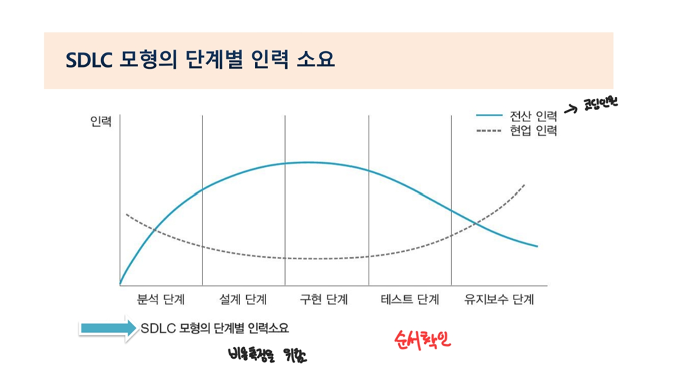
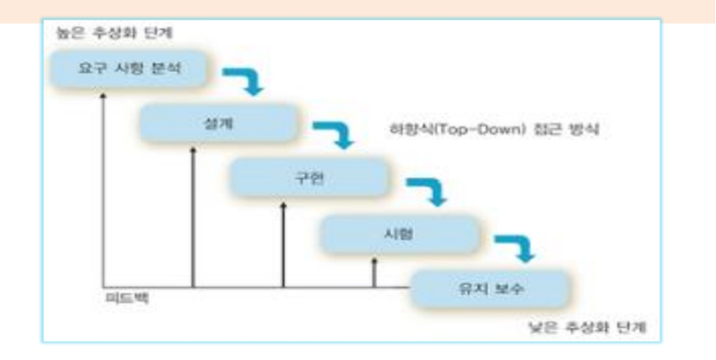
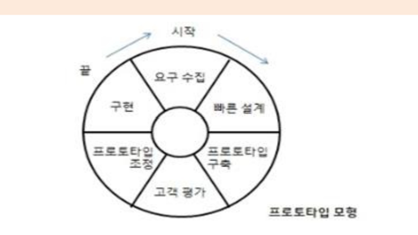
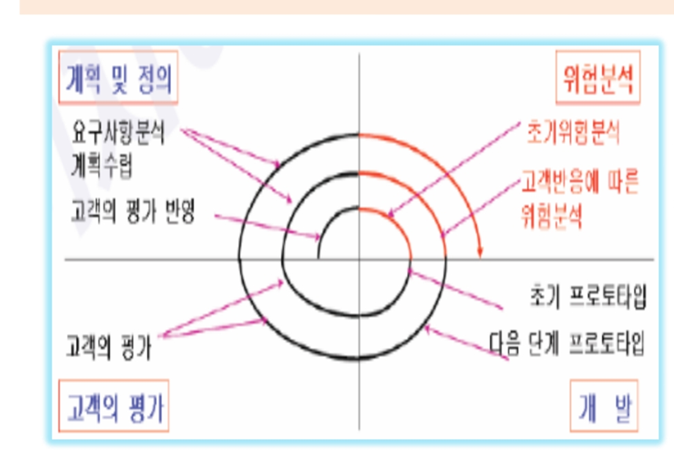
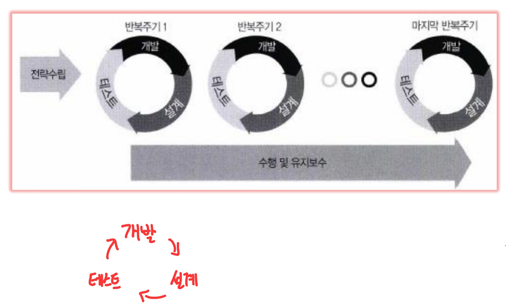

# 소프트웨어 공학

### 소프트웨어 특성
- 비가시성(Invisibility): 개념적이고 무형적(생산물의 구조가 코드안에 숨어 있음)
- 복잡성(Complexity) : 개발과정, 대상, 업무, 시스템 자체가 복잡함
  
- 순응성(Conformity) : 요구나 환경 변화에 적절히 변형 가능
- 복제 가능(Duplicability) : 극히 적은 비용으로 복제 가능

  

### 품질 좋은 소프트웨어란
- 고객 : 경제적인 이익과 효과가 있는지 평가함
- 사용자 : 신뢰도와 효율성. 일을 효율적으로 처리해주고, 배우기 쉽고 불편함이 없는지 평가함
  
- 개발자 : 설계가 쉽고 유지보수가 용이하며, 재사용하기 쉬워야하며 문저호가 잘 되어있는지 평가함
  
(각 관점에 따라 다르다)

  

### 소프트웨어 위기
#### 소프트웨어 위기(Crisis)의 원인
- 소프트웨어 특징에 대한 이해 부족 : 물리적이지 않고 논리적인 소프트웨어 특징을 이해하지 못함
- 소프트웨어의 관리부재 : 소프트웨어에 대한 관리를 소홀이 하여 효율적인 자원 통제가 이뤄지지 않음

- 프로그래밍에만 치중 : 소프트웨어의 품질이나 유지보스는 고려하지않고, 프로그래밍만 잘하려고 집학함으로써 다양하고 복잡해지는 소프트웨어의 요구사항을 처리하지 못함

 

#### 소프트웨어 위기(Crisis)의 결과
- 개발 인력의 부족과 그로 인한 인건비 상승
- 성능 및 신뢰성 부족
- 개발 기간 지연 및 개발비용 증가
- 유지보수가 어렵고 이에 따른 비용 증가
- 소프트웨어의 생산겅과 품질 저하

  

## 소프트웨어 생명주기

### 일반적인 소프트웨어 생명주기
1. 정의 단계
   - 무엇을 처리하는 소프트웨어인지 정의하는 단계
   - 타당성 검토단계, 개발 계획 단계, 요구사항 분석단계

2. 개발 단계
    - 방법에 초점을 두고 소프트웨어를 개발하는 단계
    - 설계단계, 구현단계, 테스트단계

3. 유지보수 단계
    - 변경에 초점을 두고 여러 환경 변화에 따라 소프트웨어를 적응 및 유지시키는 단계
    - 소프트웨어 생명주기 단계에서 시간과 비용이 가장 많이 든다

  

### 소프트웨어 개발 생명주기 

SDLC (Software Development Life Cycle)

계획 -> 분석 -> 설계 -> 구현 -> 테스트 -> 유지보수

유지보스 단계에서 가장 많은 시간과 비용이 든다

  

### 일반적인 소프트웨어 생명주기 (SDLC)

SDLC 모형 5단계
1. 분석 단계
1. 설계 단계
2. 구현 단계
3. 테스트 단계
4. 유지보수 단계

 
소프트웨어 개발 생명주기의 대표적인 모델

- 폭포수 모형 (waterfall model)
- 프로토타입 모형 (prototype model)
- 나선형 모델 (spiral model)
- 애자일 모형 (Agile model)

 

### SDLC 모형의 단계별 인력 소요

  

### SDLC 모형의 장단점
- 장점
  - 시스템 개발의 각 단계가 비교적 명확
  - 각 단계들 간에 유기적인 연관성을 가지고 있어 쉽게 적용할 수 있음

- 단점
  - 충분한 분석을 기반으로 개발이 진행되지 않았을 경우 테스트 단계 또는 유지보수 단계에서 문제점이 노출되어 이를 개선하는 데 많은 비용과 시간이 소요됨
  - 대형 프로젝트의 경우 긴 개발기간 동안 외부환경이나 내부 정책이 변화할 소지가 크고, 이를 개선하기 위해 이전 단계로 되돌아가 변경관리를 해야하므로 막대한 시간과 비용이 들어간다
  - 테스트 단계에서 분석과 다른게 밝혀지면 다시 분석으로 돌아가 작업하기 어렵다
  
  

### 1. 폭포수 모형

- 장점
  - 모형의 적용경험과 성공사례가 많다
  - 단계별 정의가 분명하고, 각 단계별 산출물이 정확하다

- 단점 
  - 개발 과정중 새로운 요구나 경험을 반영하기 어려움
  - 개발된 프로그램이 운용될 때 검출되지 않은 오류에 의해 사용자들의 불편을 초래할 수 있다

 

#### 폭포수 모형의 특징
- 두 개 이상의 과정이 병행 수행 되거나 이전 단계로 넘어가는 경우가 없다

- 현실적으로 오류 없이 다음 단계로 진행하기 어렵다

- 개발 과정 중에 발생하는 새로운 요구나 경험을 설계에 반영하기 어렵다

  

### 2. 프로토타입 모형(Prototype Model, 원형 모형)

- 실제 개발될 소프트웨어에 대한 견본품(prototype)을 만들어 최종 결과물을 예측함

- 개발 완료 시점에서 오류가 발견되는 폭포수 모델의 단점을 보완한 모형

- 요구분석단계에서 사용됨
- 개발 단계에서 유지보수가 이루어짐

 

#### 프로토타입 모형의 특징
- 생명주기 중간단계에서 치명적인 오류가 발생할 경우나 사용자의 요구를 잘못 받아들였을 경우 오류를 최소화

- 사용자 요구사항 변경이 용이, 요구 분석 중심의 개발 방법론

- 시스템의 요구사항이 불명확한 경우 효과적
- 소프트웨어 생명주기에서 유지보수가 없어지고 개발 단계 안에서 유지보수가 이뤄진다
- 사용자가 빠른 시간 내에 개발 완료를 요구할 때 적당한 방법

 

- Brooks 이론
    - 개발일정이 지연된다고 해서 말기에 새로운 인원을 투입하면 일정이 더욱 지연된다
    - 프로토타입은 폐기 처분하는 첫 번째 시스템이다

  

### 3. 나선형(Spiral Model, 점진적 모형)

- 대규모 프로젝트나 큰 시스템에 적합
  
- 추가적인 요구사항이 첨가 가능하므로 유지보수 과정이 필요없음

- 업무 영역을 여러 개의 작업 단위로 나눈다
  1. 계획 및 정의 : 개발목적, 제약 조건등을 설정
  2. 위험 분석 : 위험 요소를 분석하고 기능 선택의 우선순위를 지정
  3. 공학적 개발 : 개선된 한 단계 높은 수준의 프로토타입을 개발
  4. 고객 평가 : 개발된 결과(프로토타입)를 평가함

  

#### 나선형 모형의 특징
- 대규모 프로젝트에 적당함
- 위험 분석에 중점을 두어 프로토타입을 발전 시킬 때 마다 점증적으로 소프트웨어 개발을 한다

- 유지보수는 처리 절차에 포함되지 않는다

 
1단계 : 계획수립 -> 위험분석 -> 개발 -> 고객평가 (10%완성) 
2단계 : 계획수립 -> 위험분석 -> 개발 -> 고객평가 (34%완성) 
3단계 : 계획수립 -> 위험분석 -> 개발 -> 고객평가 (77%완성) 
4단계 : 계획수립 -> 위험분석 -> 개발 -> 고객평가 (87%완성) 

  

### 4. 애자일 모형(Agile Model)

- 애자일은 '민첩한', '기민함' 이라는 의미로, 고객의 요구사항 변화에 유연하게 대응할 수 있도록 일정한 주기를 반복하면서 개발 과정을 진행함
  - 특정 개발 방법론이 아니라 좋은 것을 빠르고 낭비 없도록 고객과의 소통에 초점을 맞춘 방법론
  - Sprint 또는 Iteration이라고 불리는 짧은 개발 주기를 반복하며 반복되는 주기마다 만들어지는 결과물에 대한 고객의 평가와 요구를 적극 수용함

  - 각 개발 주기에서는 고객이 요구사항에 우선순위를 부여하여 개발 작업을 진행함
  - 소규모 프로젝트, 고도로 숙달된 개발자, 급변하는 요구사항에 적합

 

#### 애자일 모형의 가치와 실행 지침
- 4가지 핵심가치
    1. 프로세스와 도구보다는 개인과 상호작용에 더 가치를 둔다
    2. 방대한 문서보다는 실행되는 SW에 더 가치를 둔다
    3. 계약 협상보다는 고객과 협업에 더 가치를 둔다
    4. 계획을 따르기 보다는 변화에 반응하는 것에 더 가치를 둔다

 

- 폭포수 모형과 애자일의 비교

| |폭포수 모형 | 애자일
--- | --- | ---
새로운 요구사항 반영 | 어려움 | 지속적으로 반영
고객과의 의사소통 | 적음 | 지속적임
테스트 | 마지막에 모든 기능을 테스트 | 반복되는 일정 주기가 끝날때마다 테스트
개발 중심 | 계획, 문서(메뉴얼) | 고객

  

### 소프트웨어의 기본 원칙
- 현대적인 프로그래밍 기술을 계속적으로 적용해야 한다
- 개발된 SW의 품질이 유지되도록 지속적으로 검증해야한다
- 소프트웨어 개발 관련 사항 및 결과에 대한 명확한 기록을 유지해야한다

  

### 좋은 소프트웨어의 품질 특성
- 사용자의 요구대로 동작해야한다
- 하드웨어 자원을 효율적으로 이용할 수 있어야한다
- 일정 시간 내 주어진 조건 하에 원하는 기능을 실행할 수 있어야한다
- 처리절차에 맞게 정확한 결과를 산출해야한다
- 소프트웨어의 개발, 유지보수 등이 초기 예상 비용이내에서 수행되어야 한다
- 사용자 인터페이스가 편리해야한다
- 유지보수가 용이하고 신뢰성이 높아야한다
- 잠재적인 에러가 최소화되어야한다
- 소프트웨어의 사용법, 구조의 설명, 성능, 기능등이 이해하기 쉬워야한다
- 실행속도가 빠르고, 기억 용량을 적게 차지해야한다